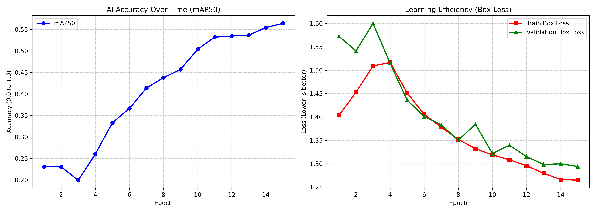
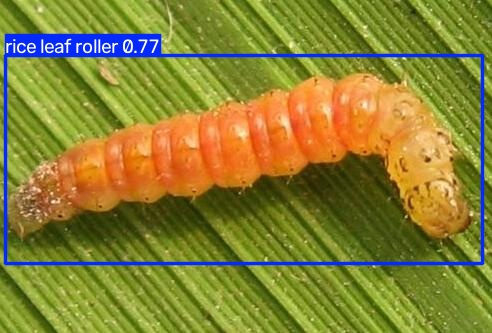
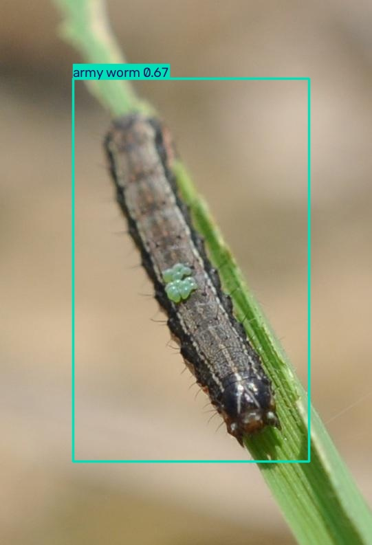
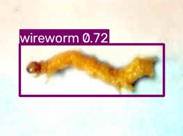
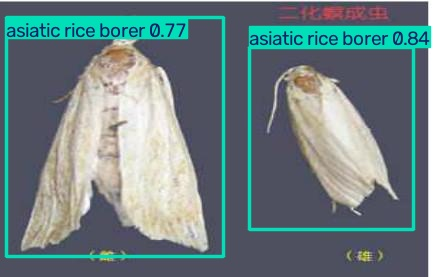
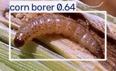
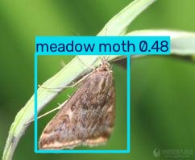
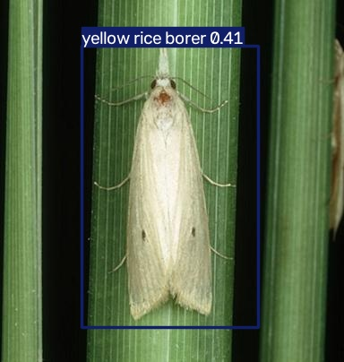
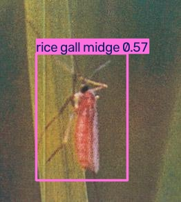

# Agri-Pest AI: Automated Insect Detection & Infestation Reporting

## The Global Agricultural Problem
Every single year, insect infestations wipe out anywhere from 20% to 40% of global food crops. That amounts to hundreds of billions in lost yield. Yet, the main defense on most commercial farms is still surprisingly archaic: someone walking the rows in work boots, flipping over random leaves to look for chewed holes. The math on that workflow is terrible. By the time human eyes actually notice a problem across a ten-acre block, the insects have already mated and laid eggs. You aren't preventing an outbreak at that point; you're just doing damage control. 

To fix this, the goal was to build an automated edge pipeline. Imagine a lightweight reporting system strapped to a low-flying quadcopter or mounted in a commercial greenhouse. Instead of manual spot-checks, the camera sweeps the crops, pinpoints the exact coordinates of any pest, identifies it from a database of 102 species, tallies the count, and hands the grower a severity report so they can actually intervene.

## The Engineering Pivot: From Cloud to Edge
Funny enough, this project didn't even start out tracking insects. Originally, the plan was to build a semantic segmentation model extracting farm boundaries from Sentinel-2 satellite tiles. That idea hit a hardware wall fast. Raw NetCDF files and 16-bit GeoTIFFs pushed the dataset past 70 gigs. Running this on an MSI Prestige 14 with a mobile 6GB RTX 4050 turned into a nightmare. The memory paging alone was brutal, and Python would grind to an absolute halt the second tensors spilled over into system RAM. 

Refusing to burn cash renting A100 instances on AWS, the only option was a hard pivot. The new mission became solving an equally tough computer vision problem while designing the architecture purely around strict local VRAM limits. Honestly, edge constraints map better to real-world farming anyway. Flying an autonomous drone over a random cornfield rarely comes with a reliable 5G connection to stream gigabytes of 4K video to the cloud. Compute has to happen right there on the silicon.

## Architectural Selection: Why YOLOv9-Compact?
Dealing with video feeds requires high frame rates, which made YOLOv9 the obvious choice. Two-stage networks like Faster R-CNN deliver gorgeous, clean masks, but they crawl like a snail when fed video streams on weak hardware. 

To stop the GPU from thermally throttling or crashing out on memory errors, the full-sized `yolov9-e` model was off the table. The sweet spot ended up being **YOLOv9-Compact (yolov9c.pt)**. Thanks to Programmable Gradient Information (PGI) and a Generalized Efficient Layer Aggregation Network (GELAN), this variant keeps mean Average Precision (mAP) high while slashing the parameter count. Intermediate tensors stay small. 

Flipping on PyTorch's Automatic Mixed Precision (AMP) was the final optimization. Running forward passes and loss math in FP16 instead of FP32 practically cut memory overhead in half. Peak VRAM usage stayed pinned right at 5.8 GB on a 6GB card, maximizing the batch size without nuking the CUDA runtime.

## The Dataset & The Long-Tail Imbalance Trap
Training an object detector on over a hundred different classes requires serious volume. IP102 is basically the gold standard dataset for farm pest identification, covering 102 species—everything from the African Mole Cricket to the Rice Leaf Roller. A YOLO-formatted release off Kaggle provided around 17,000 labeled images. 

Extreme class imbalance turned out to be the real nightmare here. That's just biology for you. Common potato beetles had thousands of photos, while some rare borers had maybe fifty. Training a model blindly on that kind of split teaches it to cheat. It figures out that guessing the top five most common bugs keeps the loss function happy, completely ignoring the rare stuff. 

Combatting that bias meant relying heavily on **mosaic data augmentation** in the loader. The pipeline grabs four random training photos, scales them, crops them, and stitches them together into one weird 4-quadrant canvas. Forcing the AI to find tiny pests against super cluttered, unexpected backgrounds stops it from just memorizing the leaf textures of high-frequency classes.

## The Training Journey & Crash Recovery (The 26-Epoch Story)
Running this training loop locally was messy and required constant babysitting. 

During the first pass through the 17,000 images, Windows hit a massive bottleneck trying to transfer memory. With the data loader set up using 8 CPU worker processes, the laptop's processor couldn't keep up with the constant image resizing and mosaic stitching. A pipeline backup straight into the GPU queue followed. The driver freaked out, threw a fatal `CUDNN_STATUS_INTERNAL_ERROR`, and killed the whole script about eight hours in. 

Throwing away a third of a day of compute time wasn't an option. Writing a quick resume script saved the day—pointing it to the `last.pt` checkpoint file and dropping the workers down to 2 smoothed out the CPU-to-GPU handoff. The run kicked back off with all optimizer momentum preserved. 

Pausing at Epoch 15 allowed for a quick weight check on some test photos. Finding bounding boxes was easy, but fine-grained classification was terrible. The AI knew exactly where a bug was sitting, but kept swapping identities between bugs that looked sort of similar. 

Fifteen epochs just wasn't enough time for the convolutions to figure out subtle wing vein patterns and antenna lengths across 102 categories. Letting the loop run to **Epoch 26** provided exactly what it needed. Box regression loss flattened out, classification errors dropped, and the model finally started telling lookalike species apart without overfitting to background leaves.

## The Final Product: A Complete Inference Pipeline
Countless vision tutorials just draw a colored box on a picture and call the project finished. That does absolutely nothing for an agronomist managing actual fields. Making `inference.py` a functional, automated data collection tool was a priority. 

Feeding a directory of crop photos into the script triggers four core actions:

1. **Detection & Localization:** Frames run through the model, Non-Maximum Suppression (NMS) deletes duplicate boxes, and the bounding coordinates are generated.
2. **Species Mapping:** Instead of printing out useless integer IDs like `14` or `82`, the code cross-references a mapped `classes.txt` dictionary to print the plain-English biological name right above the bug.
3. **Pest Density Tracking:** Counting how many pests are in each frame translates that total into a threat rating (Clean, Low, Moderate, Severe).
4. **CSV Export:** Every detection, total count, and confidence score gets dumped straight into a Pandas DataFrame, saving an `infestation_report.csv` file for actual record-keeping.

## Empirical Results & Visual Analysis
Testing how the network handled real-world noise meant running it against a held-out test split it had never seen before. Doing this proves the model learned insect anatomy instead of just memorizing training data lighting.

Check out these eight completely different detection scenarios:

### Output Analysis

**1. Morphological Camouflage Detection**

*Spotting this rice leaf roller with a 0.77 confidence score is impressive since the pale green segmented body blends perfectly into the leaf veins underneath. The network managed to isolate the bug's edges without getting thrown off by the ridges of the plant.*

**2. Narrow-Profile Target Isolation**

*An army worm (0.67 confidence) sitting on a narrow stem surrounded by heavy optical blur. Ignoring all those depth-of-field artifacts allowed the model to fit a really tight box around the caterpillar.*

**3. Low-Resolution Feature Extraction**

*This wireworm picture is noisy, super low-resolution, and lacks any typical field greenery. Pulling a 0.72 confidence rating here shows the architecture is looking at the segmented body shape instead of just hunting for green leaves.*

**4. Multi-Instance Lab Specimen Recognition**

*A nice double-detection showing two asiatic rice borers at 0.77 and 0.84. These pinned museum bugs are resting on printed index cards. The black text was totally ignored in favor of locking onto the moth wings.*

**5. Burrowing Pest Detection**

*Even with this corn borer (0.64) tunneled halfway into a stalk, the visible head and upper thorax were enough to trigger a positive identification.*

**6. Edge-Case Lighting & Angles**

*Photographed from a steep overhead angle against some very flat green leaves, this meadow moth (0.48) was still caught thanks to that distinct triangular wing layout.*

**7. High-Difficulty Color Blending**

*Easily one of the hardest validation images in the set. The yellow rice borer is a pale, washed-out moth sitting flat on a similarly colored stalk. Securing a true positive at 0.41 happened despite barely any tonal contrast.*

**8. Micro-Target Identification**

*This tiny, gnat-like rice gall midge features translucent wings and thin legs blending right into the leaf. Locking onto the red thorax resulted in a solid 0.57 confidence level.*

### The Actionable Data Output
Nobody cares about computer vision if the metrics can't be exported. Here is an excerpt from the automated CSV file that spits out after the pipeline processes a camera directory:

| Image_Name | Total_Pests_Detected | Detected_Species | Infestation_Level |
| :--- | :--- | :--- | :--- |
| field_cam_01.jpg | 0 | None | Clean |
| field_cam_02.jpg | 2 | Colorado_potato_beetle | Low |
| field_cam_03.jpg | 9 | Rice_leaf_roller | Severe |

## Tech Stack & Hardware Specifications
* **Base Language:** Python 3.11
* **Frameworks:** PyTorch & Ultralytics YOLOv9
* **Data Processing:** Pandas (CSV generation) & NumPy
* **Computer Vision:** OpenCV (cv2)
* **Dev Machine:** MSI Prestige 14
* **GPU:** NVIDIA GeForce RTX 4050 Laptop GPU (6GB VRAM)
* **Training Time:** ~20 Hours total across 26 Epochs (~17,000 images, AMP enabled)

## Reproducibility: How to Run the Pipeline Locally
Spinning this project up on a local machine requires the following steps:

**1. Install Dependencies**
Create a clean virtual environment and install the required packages:

    pip install -r requirements.txt

**2. Download the Dataset & Configure YAML**
Grab the YOLO-annotated IP102 dataset from Kaggle, unpack it into the project root, and run the preparation script to generate the dataset YAML file:

    python data_prep.py

**3. Train the Model**
Launching the training loop defaults to YOLOv9c with AMP enabled. Restricting the data loader to 2 worker threads keeps Windows from totally freezing up:

    python train.py

**4. Evaluate Metrics**
Parsing the training run logs with this script uses matplotlib to plot the loss curves and mAP improvements across all epochs:

    python evaluate.py

**5. Run the Field Scanner**
Drop uninspected crop photos into the input folder, double-check the source directory path in `inference.py`, and run the scanner to generate annotated images plus the summary CSV:

    python inference.py

